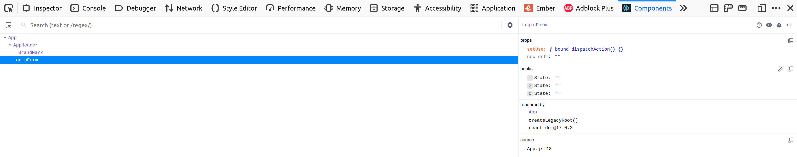
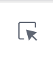
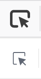

# React Dev Tools: Components

React is an abstraction on top of the DOM. While this abstraction is powerful, it limits the usefulness of the existing DOM-based browser dev tools. For example, how can you see the component hierarchy or examine the state of a component? The React Dev Tools browser extension adds new tabs to your dev tools that allow you to examine components the same you inspect DOM elements in the Element Inspector.

## Installation

React Dev Tools are available for Chrome and Firefox as browser extensions.

* [Chrome Installer](https://chrome.google.com/webstore/detail/react-developer-tools/fmkadmapgofadopljbjfkapdkoienihi?hl=en)
* [Firefox Installer](https://addons.mozilla.org/en-US/firefox/addon/react-devtools/)

You may need to restart your browser or reload pages after installing the extensions.

## Components

The components tab shows a complete hierarchy of the components in your app. Selecting a component will show you the current state of the component and any props it was given.

| Button | Function |
| --- | --- |
|  | Select an item on the screen to see what component it's part of |
|  | Examine the DOM element a component rendered in the element inspector |
|  | Log a component's data to the console |
|  | See the source code for a component |

The function of other buttons can be determined by hovering over them and reading the tool tip.

## Watch Out!

The pointer icon that allows you to select a component on the page is the same as the regular dev tools element selector. This is intentional. The top icon selects DOM elements, the bottom icon selects React components.

## Additional Resources

| Resource | Description |
| --- | --- |
| [Flavio Copes: How to use the React Dev Tools](https://flaviocopes.com/react-developer-tools/) | Blog post on using React dev tools |
| [Chrome: React Dev Tools](https://chrome.google.com/webstore/detail/react-developer-tools/fmkadmapgofadopljbjfkapdkoienihi?hl=en) | The Chrome installer for React Dev Tools |
| [Firefox: React Dev Tools](https://addons.mozilla.org/en-US/firefox/addon/react-devtools/) | The Firefox installer for React Dev Tools |
| [GitHub: React Dev Tools](https://github.com/facebook/react/tree/main/packages/react-devtools) | The GitHub source code and README |
